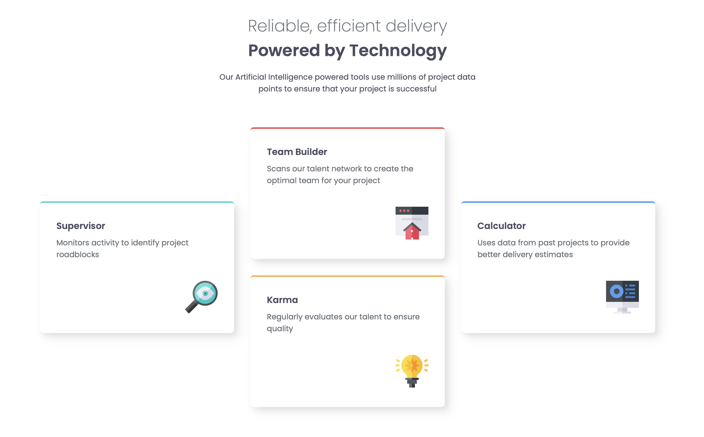

# Frontend Mentor - Four card feature section solution

This is a solution to the [Four card feature section challenge on Frontend Mentor](https://www.frontendmentor.io/challenges/four-card-feature-section-weK1eFYK). Frontend Mentor challenges help you improve your coding skills by building realistic projects. 

## Table of contents

- [Overview](#overview)
  - [The challenge](#the-challenge)
  - [Screenshot](#screenshot)
  - [Links](#links)
- [My process](#my-process)
  - [Built with](#built-with)
  - [What I learned](#what-i-learned)
  - [Continued development](#continued-development)
  - [Useful resources](#useful-resources)
- [Author](#author)
- [Acknowledgments](#acknowledgments)

## Overview

### The challenge

Users should be able to:

- View the optimal layout for the site depending on their device's screen size

### Screenshot

### Links

- Solution URL: [GitHub](https://github.com/KaiWenzel/four-card-feature-section-master)
- Live Site URL: [Pages](https://kaiwenzel.github.io/four-card-feature-section-master/)

## My process

### Built with

- Semantic HTML5 markup
- CSS custom properties
- Flexbox
- CSS Grid
- [SASS](https://sass-lang.com) - CSS Pre-Processor

### What I learned

I leanred how to use SASS this time. Creating modules can be really handy for keeping everything organized, but takes some time if you need to switch between files constantly.

This was also the first time I used Grid. It's quite handy for making some more complex responsive layouts. 

### Continued development

In the next projects I would like to use Grid. 

### Useful resources

- [gridbyexample](https://gridbyexample.com) - Good reference for all about Grid. 
- [Gemini](https://gemini.google.com) - For finding errors in my code. 

## Author

- Website - Kai Wenzel (No official Website yet)
- Frontend Mentor - [@KaiWenzel](https://www.frontendmentor.io/profile/KaiWenzel)

## Acknowledgments

Thanks to Frontend Mentor for providing me with the designs. 
